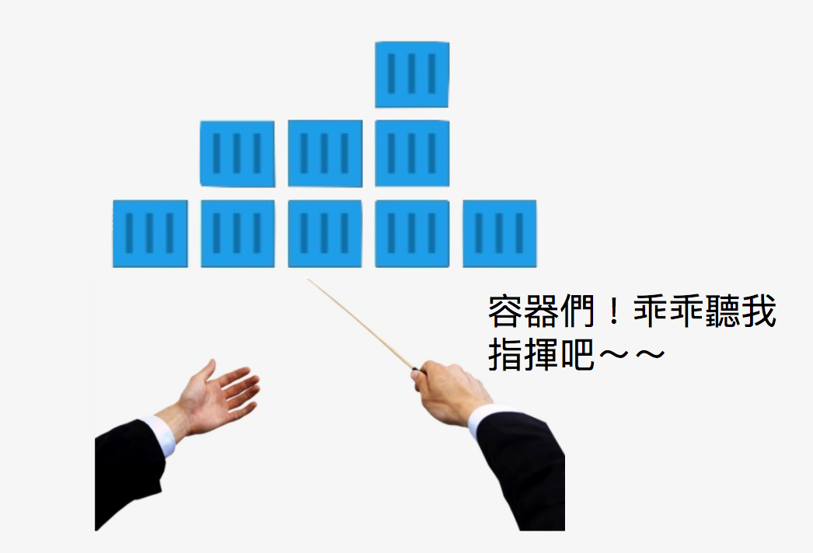

## 前言
近幾年，雲端平台（AWS, GCP, Azure, ...）的興起，大幅提升取得運算資源 (cpu, memory, volume, ...) 的方便性。接著無狀態（Stateless）的應用，水平擴展 (Horizontal Scaling) 程式因應龐大的用戶端訪問變得容易。隨後到來的容器 (container)，提供一致性的基礎架構。再輔以微服務 (Micro Services) 架構降低了程式耦合度 (Loose Coupling)，使得每個服務能更專注在個別提供的功能上。而 Kubernetes (k8s) 的出現，則是讓管理容器更簡潔方便。

未來的三十天，讓我們從觀念開始欣賞 k8s，接著透過實際操作更近一步了解 k8s。
> **關於 k8s**
> 
> k8s 目前相當活躍，平均三個月會更新一次。本次鐵人賽意在將基本觀念與操作帶給大家，期望有了基本觀念後，日後再針對其他項目加強。因此，只會針對最重要的物件進行說明。
> 
> 就在幾天前 k8s 已經正式發佈 v1.9 版本。k8s 不自賞一文操作的環境是以 v1.8 為主，請特別注意。

為方便閱讀，每日文章將會包含下列主題

* `本日共賞`：**Topic**, 即今日分享主題
* `希望你知道`：**Prerequisites**, 對於了解`本日共賞`有幫助的議題
* `本文`：文章本體

* >額外補充會寫在這裡

``` 
<=== 這是程式中額外的解釋，要仔細找喔
```

```
$ 這個後面的是指令，請記得不要連 '$' 都打進去了
```

### 文章連結
這裡會放置 30 天文章的連結，以方便查閱

> 概念篇：一無所知不用怕，從這裡開始認識 k8s 吧！

 * `Day 1`：[Container Orchestration](https://ithelp.ithome.com.tw/articles/10192193)
 * `Day 2`：[k8s 架構](https://ithelp.ithome.com.tw/articles/10192409)
 * `Day 3`：[k8s 安裝須知](https://ithelp.ithome.com.tw/articles/10192448)
 
> 基礎篇：台上十分鐘台下十年功，一起打好基礎吧！
 * `Day 4`：[安裝 k8s](https://ithelp.ithome.com.tw/articles/10192748)
 * `Day 5`：[運行 minikube](https://ithelp.ithome.com.tw/articles/10193237)
 * `Day 6`：[與 k8s 溝通: APIs](https://ithelp.ithome.com.tw/articles/10193489)
 * `Day 7`：[與 k8s 溝通: Dashboard](https://ithelp.ithome.com.tw/articles/10193497)
 * `Day 8`：[與 k8s 溝通: kubectl](https://ithelp.ithome.com.tw/articles/10193502)
 * `Day 9`：[yaml](https://ithelp.ithome.com.tw/articles/10193509)
 * `Day 10`：[建構組件](https://ithelp.ithome.com.tw/articles/10193513)
 * `Day 11`：[Service (1)](https://ithelp.ithome.com.tw/articles/10193520)


> 常見問題與建議：使用 k8s 常撞牆嗎？來看看這裡的建議吧！
 
> 應用篇：江湖在走，k8s 要有


時間寶貴，就讓我們開始好好欣賞一下 k8s 吧！


### 本日共賞
* Container Orchestration
* Container Orchestration 的好處

在開始討論 k8s 之前，我們先來聊一下容器 (Container)

<br/>

#### Contaner

容器是一種以應用程式為中心 (application-centric) 的架構，能夠在選定的基礎環境中 (Infrastructure) 部署高效率 (high-performance)、可擴充 (scalable) 與個別獨立 (isolate) 的應用程式。


**選定的基礎環境**：可自行決定需要使用的環境、版本。
>*試試撰寫 Dockerfile*

**高效率**：不似龐大的系統，啟動一個容器只需短短幾秒
>*試試 docker run*

**可擴充**：可動態新增或刪除容器

**個別獨立**：容器可互相溝通但容器間的運作並不會互相干擾

其中高效率、可擴充與個別獨立為容器的主要特色。再來由於容器可以部署在多種不同環境 (Desktop, VMs, Cloud 等等)，不但增加了便利與彈性，更能確保跨平台的一致性。

>**一致性**
>
>開發程式最常見的的問題是 *"我的電腦可以跑！沒問題"* ，但事實可能是 *"就只有我的電腦可以跑"*。透過容器一致性的特性能確保使用的環境都是一致的而不再因為環境的不同造成程式無法運作。

容器中最為人熟知的莫過於 Docker，而 Docker 恰恰是 k8s 預設使用的容器。因此，如果對 Docker 的概念已經了解的話，對學習 k8s 是有加分的效果。當然，如果不會也沒有關係，可以先了解 k8s 後再自行研讀。

> 這次鐵人賽有大大分享 Docker 相關知識可以參考喔
> 
> [yangj26952](https://ithelp.ithome.com.tw/users/20103456/profile)： [用30天來介紹和使用 Docker](https://ithelp.ithome.com.tw/users/20103456/ironman/1320)
>
> [jia_hong](https://ithelp.ithome.com.tw/users/20107537/profile)： [讓我們來玩玩Docker吧](https://ithelp.ithome.com.tw/users/20107537/ironman/1417) 

#### Container Orchestration
不同於開發/測試環境，在容器運行的正式環境 (production) 中，我們必須要確保應用程式能夠

* `可容錯`：當某些錯誤情況發生時，仍能確保系統能運作
* `可擴展`：在需要的時候能增加，在不需要的時候能減少
* `能充分並有效使用資源`：很重要！因為資源是要錢的！
* `容器間能互相溝通`：能察覺容器加入或刪除
* `可提供管道供外部存取`：如果外部不能存取，可就真是孤芳自賞了
* `不需要停機就能更新或回滾 (rollback)`：玩遊戲的時候，大家應該最討厭維修時間了吧

>**可擴展**
>
>可擴展應該分成兩個部分來討論：
> 
> * 硬體 (Vertical Scale)
> * 應用程式 (Horizontal Scale)
>
> `Vertical Scale`： 透過雲端平台，硬體 (host, cpu, memory, disk, ...) 的擴展可隨著需求隨時增加或減少。
>
> `Horizontal Scale`：而應用程式的可擴展則需要透過類似 Container Orchestration 這類的工具來達成。另外，此類型的擴展有時候也需要增加更多硬體。
>
> *手動擴展應用程式也是可行，但相對複雜度就會提高*

Container Orchestrator 便是幫助我們能達到上述目標的工具，常見的 Container Orchestrator 如下

* [Kubernetes (k8s)](https://kubernetes.io/)
* [docker swarm](https://docs.docker.com/engine/swarm/)
* [Amazon ECS](https://aws.amazon.com/tw/ecs/details/)
* [Marathon](https://mesosphere.github.io/marathon/)
* [Nomad](https://www.nomadproject.io/?_ga=2.7258870.592423037.1512982166-1879891168.1512982166)

>**Orchestration**
>
>記得第一次查 Orchestration 這個英文字的時候，畫面跳出 "管絃樂編曲" 的解釋時真是差點沒昏倒。一度以為是要先學個樂理才能學 k8s。
>
>比較了解 k8s 之後才發現這個用字真的很精妙。想像一下在你精妙的指揮下，運行在 k8s 中的應用程式協同運作並發揮了最大的效能。就如同管弦樂器在彼此的配合下，彈奏出一首首令人陶醉的樂章。
>
>

<br/>

#### Container Orchestrator 的好處

* 將多個主機 (Hosts or Node) 整合成一個叢集 (Cluster)，每個主機都是叢集的一部分
* 調度容器運行在不同的主機上
* 提供運行在不同主機上的容器間溝通的管道
* 連結容器與儲存 (Storage)
* 確保資源有效利用
* 確保容器運行狀態 (Healthy check)
* 確保容器內存取的安全性
* 不需要直接存取容器，而是封裝成更高階的服務 (即虛擬化)，例如 k8s 中的：Service, Ingress 等等

了解什麼是 Container Orchestrator 以及好處後，我們就可以正式進入 k8s 的世界，未來的 30 天，不！，只剩下寶貴的 29 天，就讓我們一起好好欣賞 k8s 。


本文同步發表於 [https://jlptf.github.io/ironman2018-day1/](https://jlptf.github.io/ironman2018-day1/)
